# Platform Components — Production Flow

Four core infra components and how they interact in production.

---

## Network Flow — Request from Internet

### Topology (where traffic physically goes)

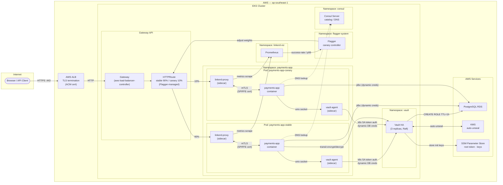

### Request lifecycle (step by step)

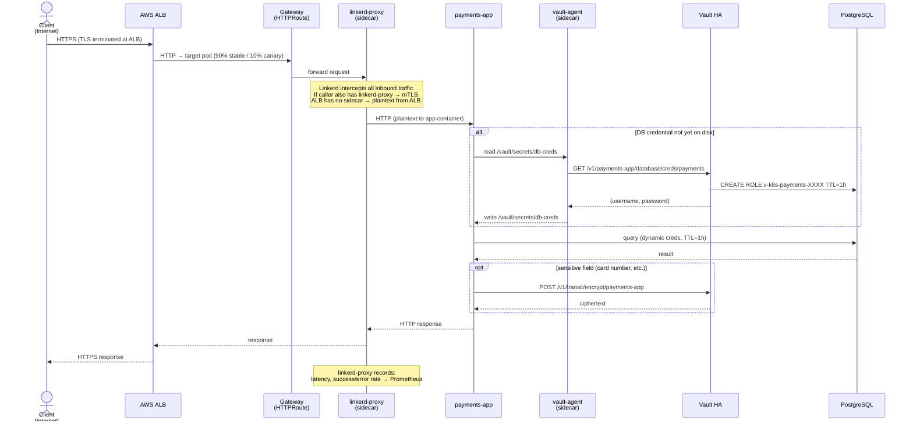

### Canary promotion flow (background, parallel to live traffic)

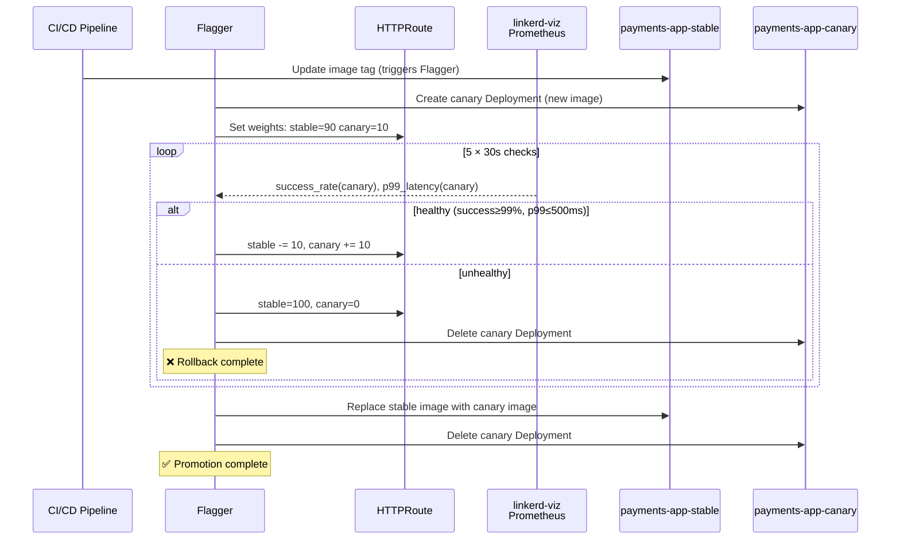

---

## 1. Linkerd (Service Mesh)

**Role**: mTLS between pods, traffic metrics, canary traffic splitting via Flagger.

### Sidecar injection + mTLS

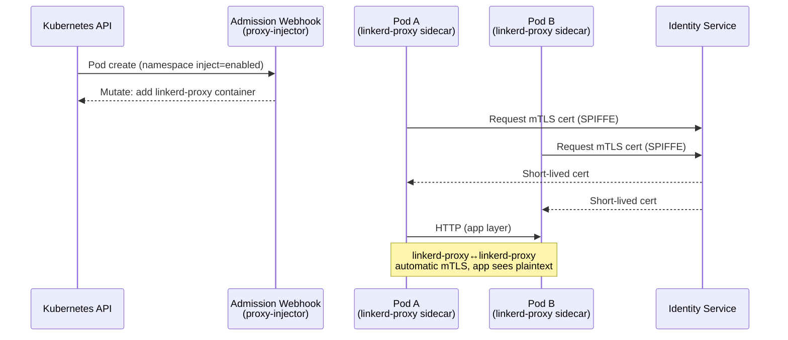

### Metrics flow (Flagger reads Prometheus)

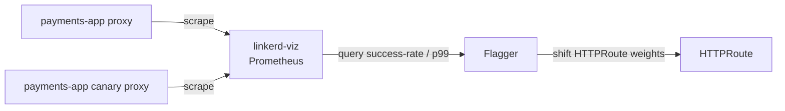

### Namespaces

| Namespace | What runs |
|-----------|-----------|
| `linkerd` | identity, proxy-injector, destination |
| `linkerd-viz` | Prometheus, tap, dashboard |
| `payments-app` | injected app pods |
| `flagger-system` | Flagger (needs Prometheus access) |

Flagger → Prometheus is blocked by default. `gitops/platform/linkerd-viz-policy/flagger-prometheus-authz.yaml` adds `AuthorizationPolicy` granting the `flagger` SA access to `prometheus-admin` Server.

---

## 2. Gateway API (Traffic Routing)

**Role**: Standard k8s routing CRDs. Replaces legacy Ingress. Required for Flagger canary.

### Resource hierarchy

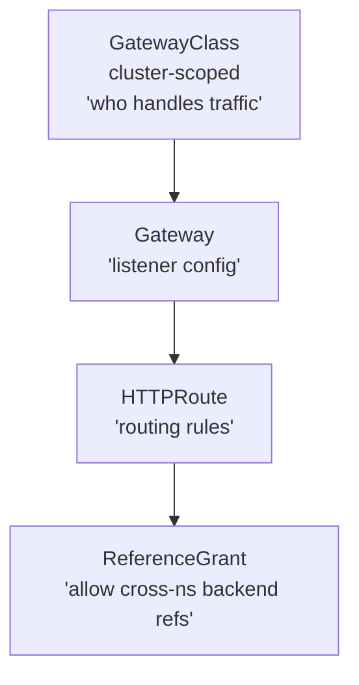

### CRD bootstrap

`gitops/apps/gateway-api-crds.yaml` is wave 0 — it installs all standard CRDs from `kubernetes-sigs/gateway-api v1.2.1` before any other app syncs. Flagger cannot create `HTTPRoute` without these CRDs present.

### Canary traffic split (Flagger)

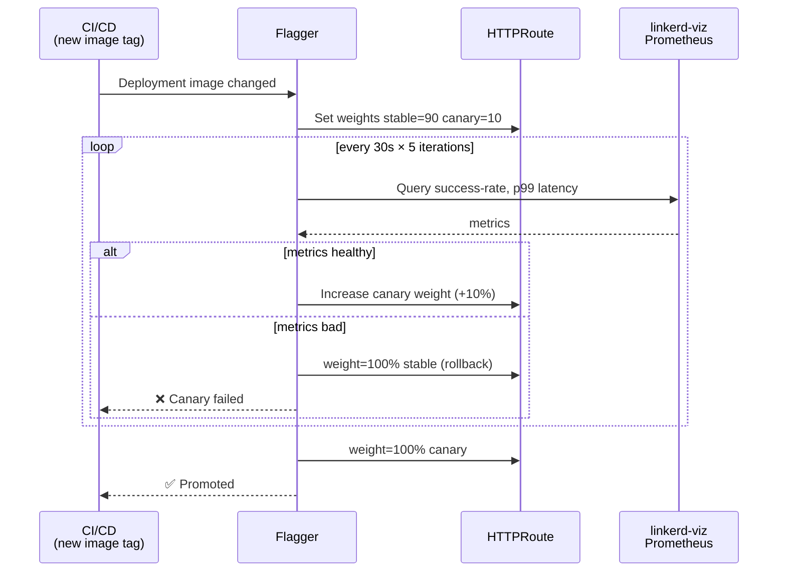

---

## 3. Vault (Secrets Management)

**Role**: Two distinct secret flows — dynamic DB credentials (short-lived) and static KV (synced via ESO).

### HA init flow (first deploy only)

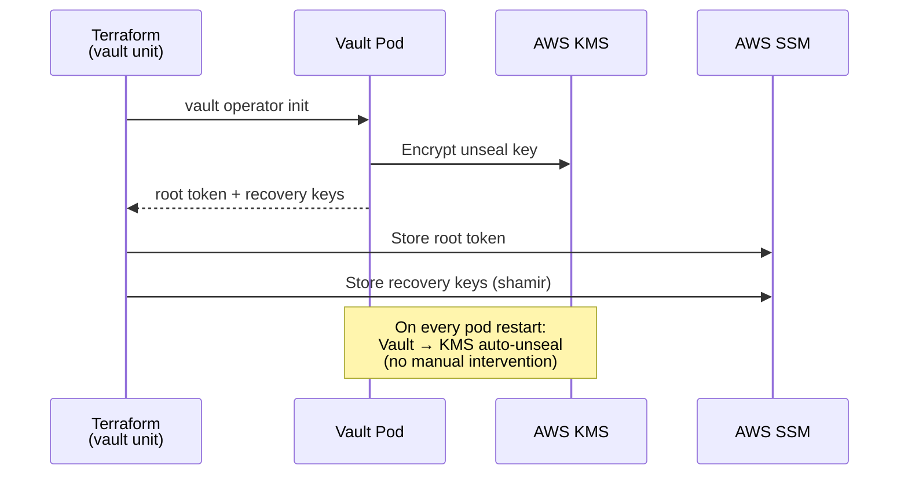

### Flow A — Dynamic DB credentials (payments-app)

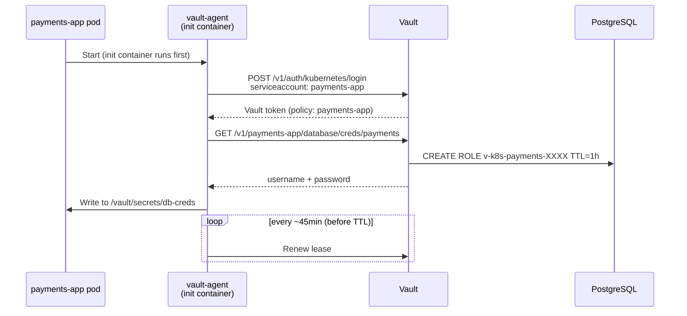

### Flow B — Static secrets via ExternalSecrets Operator

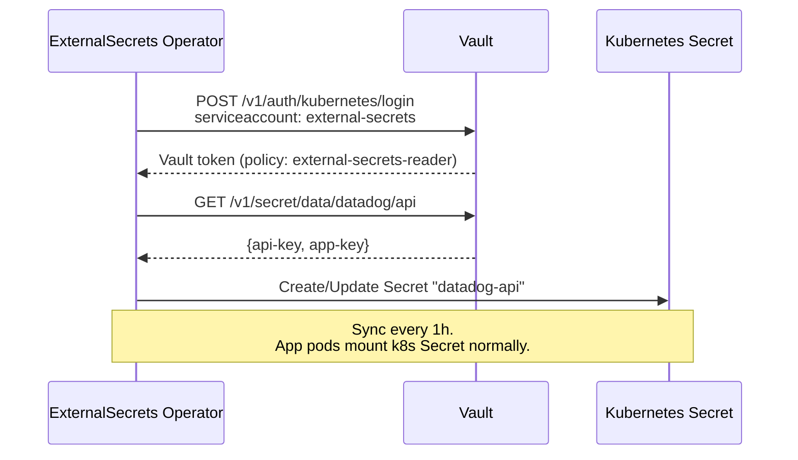

### Transit encryption (payments-app)

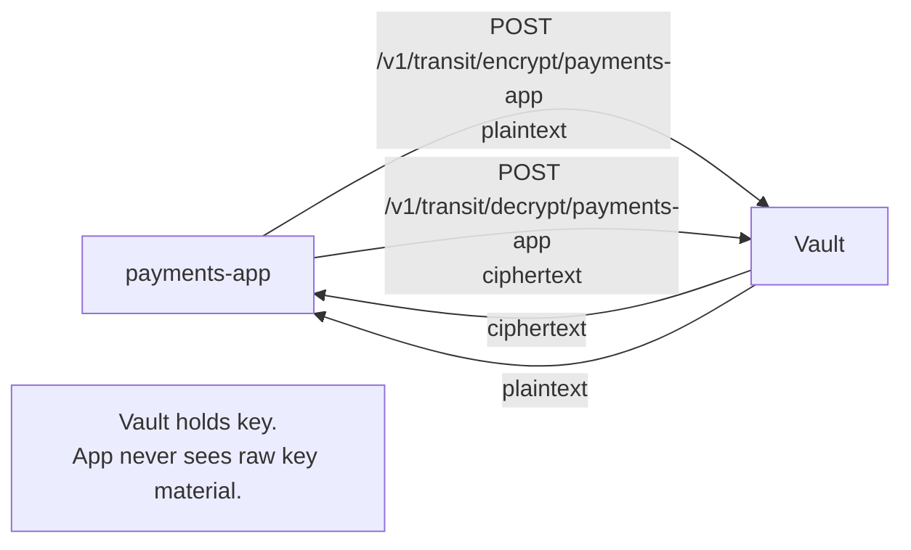

### Secret paths summary

| Path | Engine | Consumer | How |
|------|--------|----------|-----|
| `payments-app/database/creds/payments` | database | payments-app | Vault Agent sidecar |
| `transit/encrypt(decrypt)/payments-app` | transit | payments-app | direct API call |
| `secret/data/datadog/api` | kv-v2 | datadog | ESO → k8s Secret |
| `secret/data/payments-app/*` | kv-v2 | payments-app | ESO → k8s Secret |
| `payments-processor/static/data/creds` | kv-v2 | payments-processor | Vault Agent sidecar |

---

## 4. Consul (Service Catalog)

**Role**: Service discovery catalog only. **No service mesh** (connectInject disabled).

### What it does

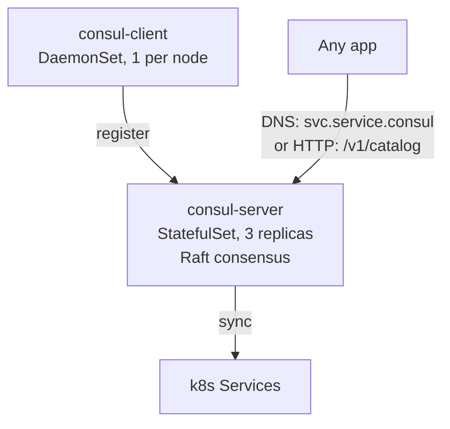

Consul does **not** inject sidecars or enforce mTLS — that is Linkerd's job. Consul owns catalog + DNS only.

### Why both Consul + Linkerd?

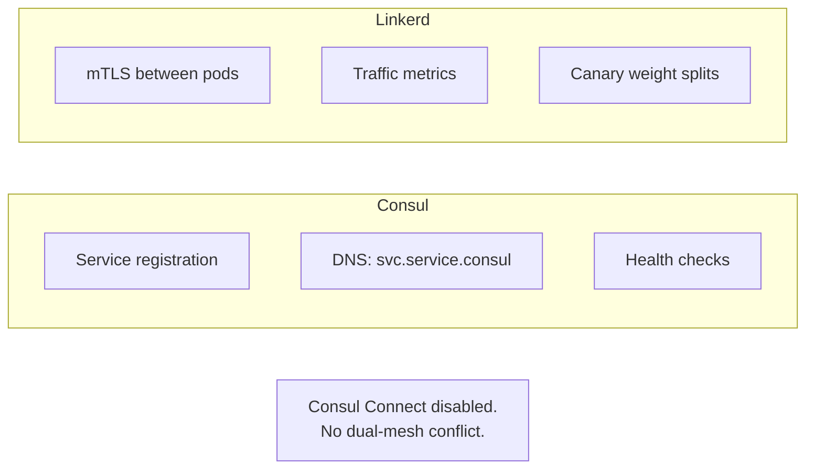

Consul was the original mesh. Linkerd was added for stronger mTLS and k8s-native metrics. Consul Connect disabled to avoid conflicts. Consul serves catalog/DNS; Linkerd owns all mesh functionality.

---

## Full Component Interaction Map

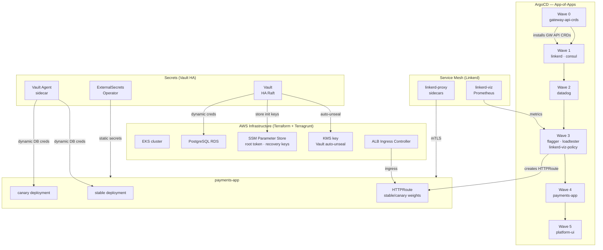

---

## Deploy Order (ArgoCD Sync Waves)

```mermaid
gantt
    title ArgoCD Sync Wave Order
    dateFormat X
    axisFormat Wave %s

    section Bootstrap
    AppProject platform       :done, w-10, -10, -9
    Gateway API CRDs          :done, w0, 0, 1

    section Mesh & Catalog
    Linkerd control-plane     :done, w1a, 1, 2
    Consul                    :done, w1b, 1, 2

    section Observability
    Datadog                   :done, w2, 2, 3

    section Canary Controller
    Flagger                   :done, w3a, 3, 4
    Loadtester                :done, w3b, 3, 4
    linkerd-viz AuthzPolicy   :done, w3c, 3, 4

    section Application
    payments-app              :done, w4, 4, 5

    section Frontend
    platform-ui               :done, w5, 5, 6
```
