# Production Flow Guide

How platform actually behaves in production. Diagrams + sequences per use case. No code, no theory.

---

## System at a Glance

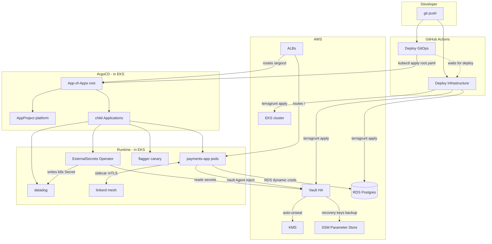

---

## Cold Start — Bootstrap from Empty AWS Account

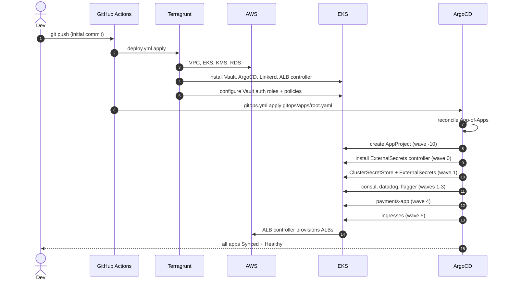

**Observable**: ~10 min cold start, ~3 min warm. `kubectl get applications -n argocd` shows all `Synced/Healthy`.

---

## Daily Use Case 1: Push GitOps-Only Change

You change a Helm value (e.g. bump replica count, rotate chart version, add Ingress).

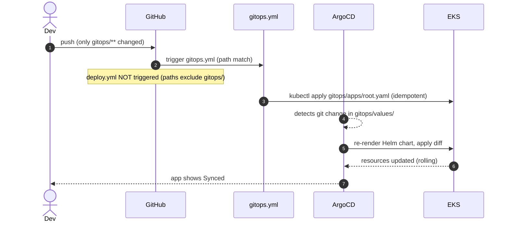

**Observable**: ~30s pipeline + ~1-3min ArgoCD reconcile. No infra apply.

---

## Daily Use Case 2: Push Terraform-Only Change

You change `units/<name>/` or `stacks/<env>/env.hcl` (e.g. EKS node size, RDS class).

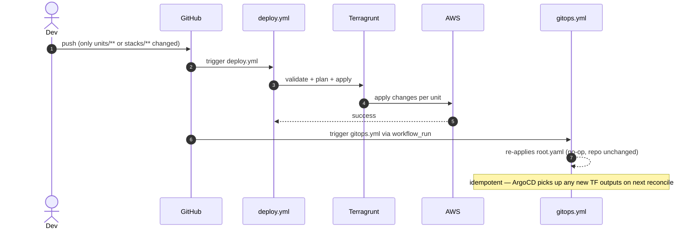

**Observable**: ~5-10min pipeline. ArgoCD apps unchanged.

---

## Daily Use Case 3: Push Touches BOTH Layers

You add a new Vault role (TF) AND a new ExternalSecret consuming it (gitops). Race risk: gitops applies before TF creates the role → ESO `permission denied`.

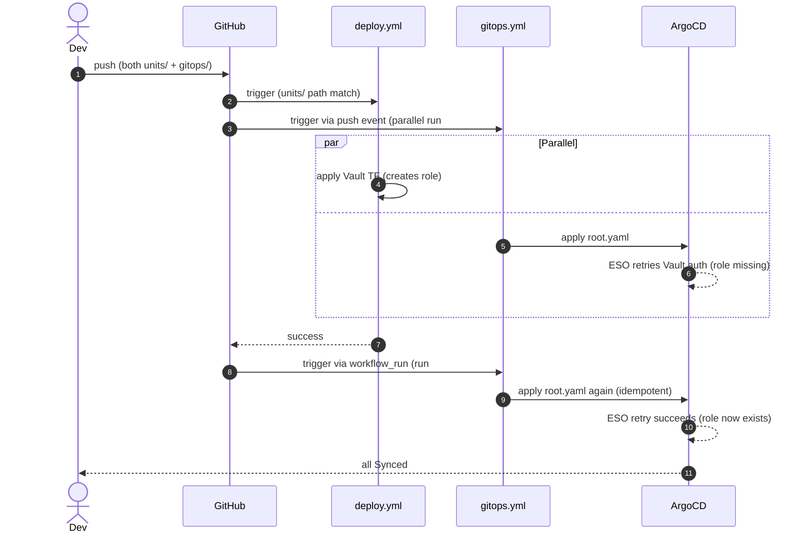

**Observable**: brief `permission denied` in ESO logs, self-heals within 1-2 min after deploy completes. **No manual intervention.**

---

## Use Case 4: Add a New Microservice

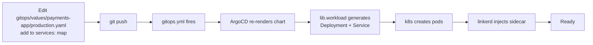

**You write**: ~10 lines in values file.
**You wait**: ~2 min.
**Done**.

---

## Use Case 5: Add a New Secret

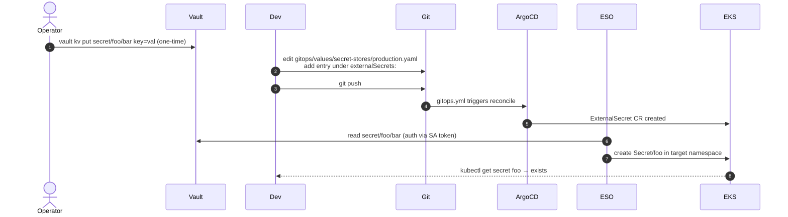

**Default**: all Vault fields → all Secret keys (no mapping needed).
**On Vault rotation**: ESO refreshes within 1h, Secret updates, consumers re-read.

---

## Use Case 6: Rotate a Secret (Zero Downtime)

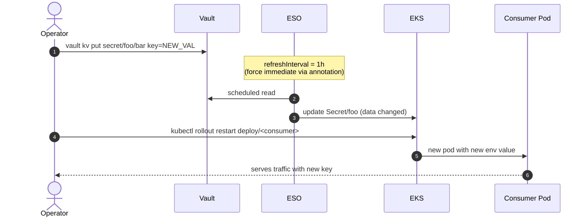

**No git push, no CI run.** Pure runtime operation.

---

## Use Case 7: Bump an Upstream Chart Version

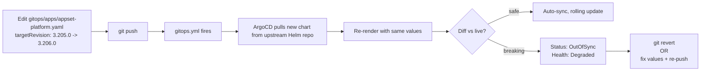

**Observable**: chart bump appears in ArgoCD UI as 1 commit diff.

---

## Use Case 8: Pod Crashes (Self-Heal)

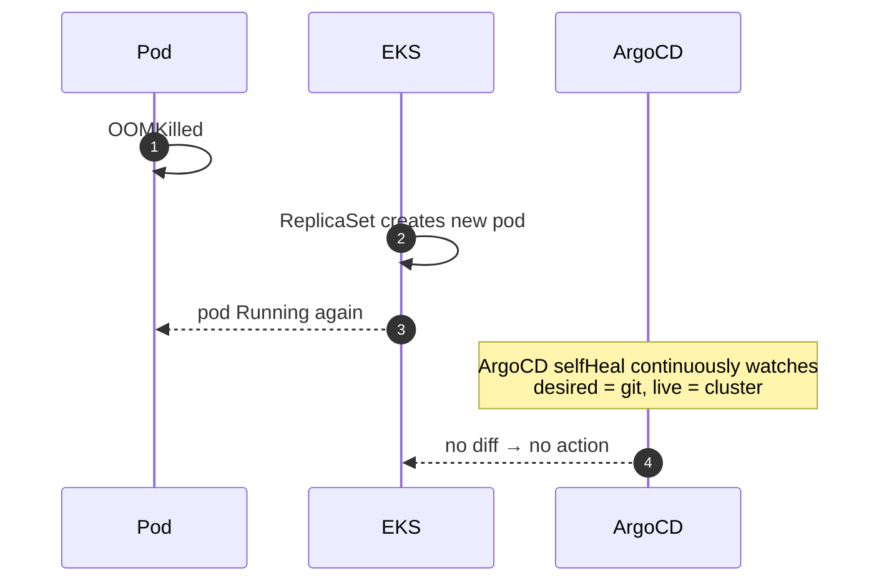

**No human in loop**. k8s ReplicaSet handles. ArgoCD only intervenes if cluster state DRIFTS from git (someone `kubectl edit`s).

If someone `kubectl scale deploy/payments-app --replicas=10`:
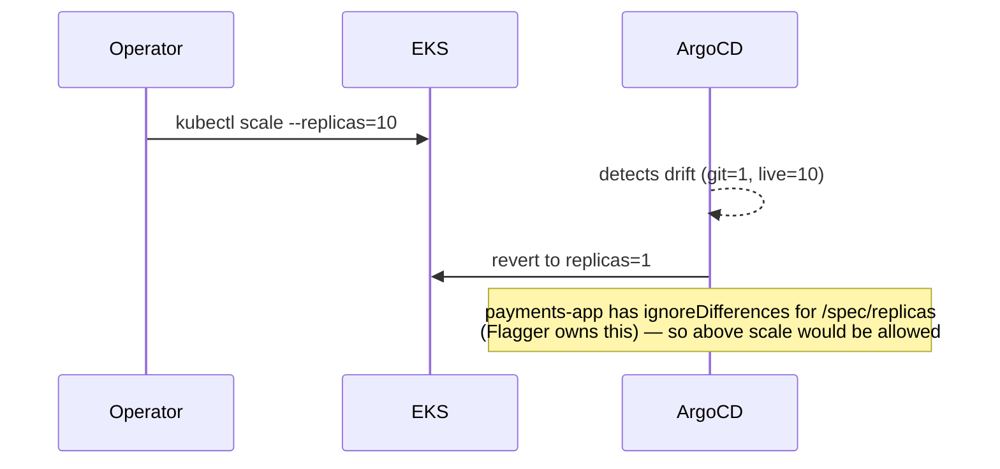

---

## Use Case 9: ArgoCD App Stuck OutOfSync

Common causes: immutable Job spec changed, helm-managed annotations differ from server-side defaults.

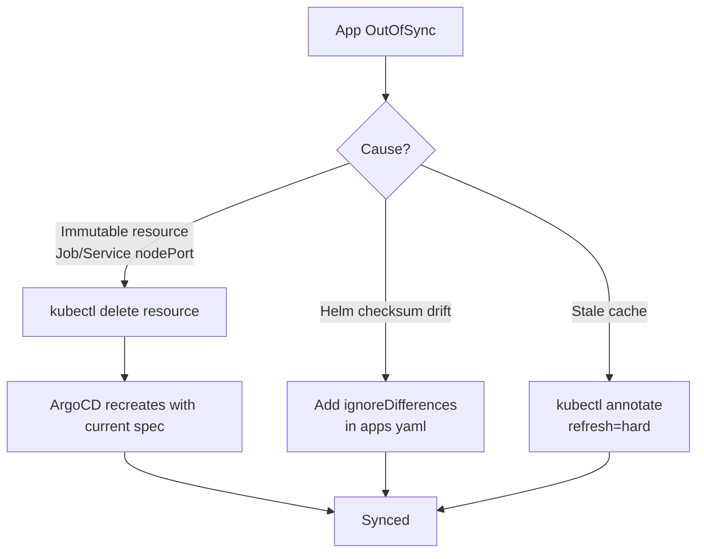

Runbooks: [`runbooks/`](runbooks/) — canary stuck, consul stale services.

---

## Use Case 10: Rollback a Bad Deploy

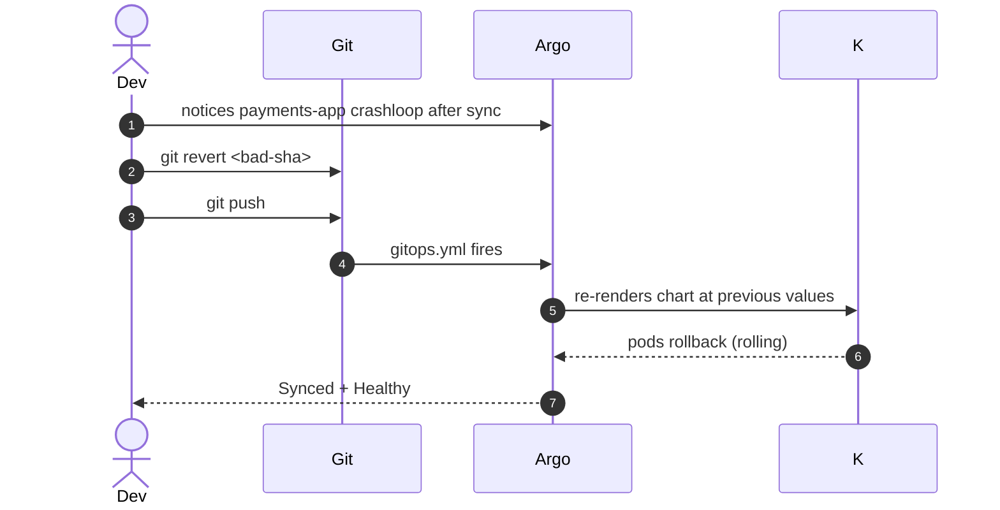

**Recovery time**: ~3 min from `git push` to all pods Healthy.

For TF rollback: same flow, `git revert` → `deploy.yml` re-applies prior infra.

---

## Use Case 11: Migrate Vault dev → HA (Planned Maintenance)

⚠️ Destructive. Plan downtime window.

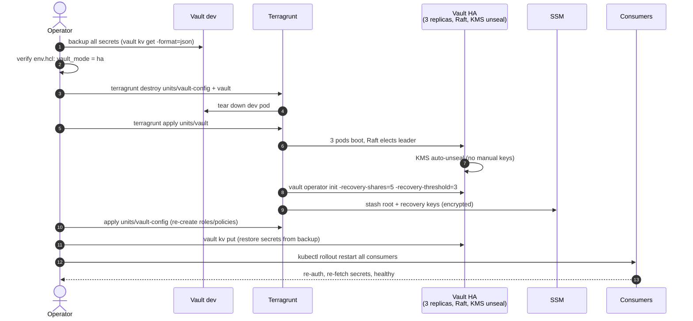

**Test in MiniStack first.** Detailed steps: [`runbooks/vault-ha-migration.md`](runbooks/vault-ha-migration.md).

---

## Use Case 12: Datadog API Key Missing (Today's Bug)

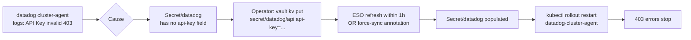

---

## Use Case 13: ALB Controller Upgrade

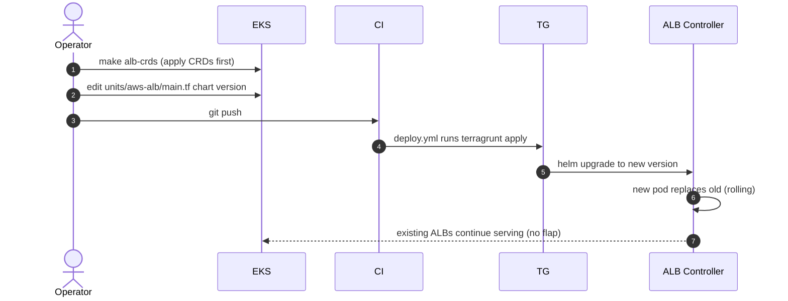

**Critical**: CRDs first, chart second. Helm doesn't upgrade CRDs.

---

## Use Case 14: Local Dev (MiniStack)

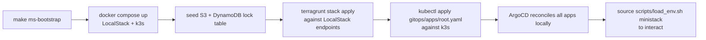

**Identical** to production flow. Same Helm charts, same Vault setup, same App-of-Apps. Only env.hcl differs (LocalStack endpoint, no NAT, no github-runner).

**Cost**: $0 + 4-8GB RAM.

---

## Use Case 15: Pipeline Failure Recovery

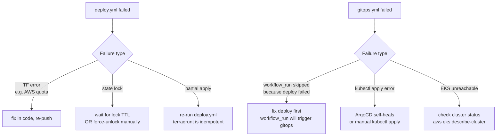

---

## Use Case 16: Onboarding a New Developer

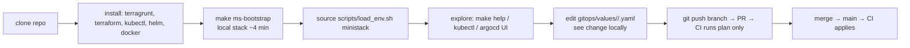

---

## Decision Trees

### "I need to add X — where do I edit?"

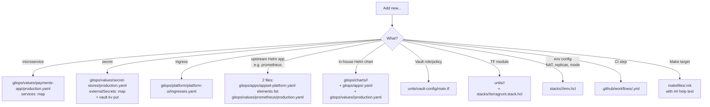

### "Something broke — where do I look?"

```mermaid
flowchart TB
  X[Broken] --> Y{Symptom}
  Y -->|app pod crashlooping| A[kubectl logs + describe<br/>kubectl get events]
  Y -->|app OutOfSync in ArgoCD| B[kubectl describe app -n argocd<br/>+ runbooks/]
  Y -->|secret missing/wrong| C[kubectl get externalsecret -A<br/>+ vault kv list]
  Y -->|ALB not provisioned| D[kubectl logs -n kube-system<br/>aws-load-balancer-controller]
  Y -->|Vault sealed/unreachable| E[make vault-status<br/>+ kubectl logs vault-0]
  Y -->|pipeline failed| F[gh run list + gh run view --log-failed]
  Y -->|RDS connection error| G[check security groups<br/>+ vault dynamic creds TTL]
  Y -->|metrics missing| H[datadog logs for 403<br/>+ check Secret/datadog populated]
  Y -->|canary stuck| I[runbooks/canary-stuck.md<br/>(linkerd-smi check)]
```

---

## Authority Matrix

| Resource | Source of Truth | Mutator | Reconciler |
|----------|-----------------|---------|------------|
| AWS infra (VPC, EKS, RDS, IAM) | `units/<name>/` | CI (`deploy.yml`) | Terragrunt |
| Vault auth roles/policies | `units/vault-config/` | CI | Terragrunt |
| Vault secret values | Vault KV | Operator (manual `vault kv put`) | none — operator owns |
| ArgoCD Applications | `gitops/apps/` | CI (`gitops.yml`) | ArgoCD |
| Helm chart values | `gitops/values/<app>/<env>.yaml` | git → CI | ArgoCD |
| k8s Secrets | ExternalSecrets CR (rendered from values) | ESO controller | ESO |
| payments-app replicas | Flagger (canary) | Flagger | (ArgoCD ignores) |
| ALB instances | Ingress objects | ArgoCD | aws-load-balancer-controller |
| RDS dynamic DB users | Vault DB engine | payments-app pod request | Vault (TTL revoke) |

---

## Time-to-Recovery Cheatsheet

| Scenario | RTO |
|----------|-----|
| App pod crash | seconds (k8s ReplicaSet) |
| Drift (kubectl edit) | seconds (ArgoCD selfHeal) |
| Bad gitops push | ~3 min (revert + re-deploy) |
| Bad TF apply | ~10 min (revert + re-apply) |
| Datadog API key invalid | minutes (vault kv put + restart) |
| Vault dev pod restart (loses secrets) | minutes (re-put all secrets manually) |
| Vault HA pod restart | seconds (Raft + KMS auto-unseal) |
| EKS node failure | minutes (auto-replace via ASG) |
| Cluster lost | hours (full bootstrap from scratch) |

---

## See Also

- [`architecture.md`](architecture.md) — env topology + network/vault diagrams
- [`adr/`](adr/) — why decisions were made
- [`runbooks/`](runbooks/) — step-by-step fix recipes
- [`gitops/README.md`](../gitops/README.md) — GitOps deep dive
