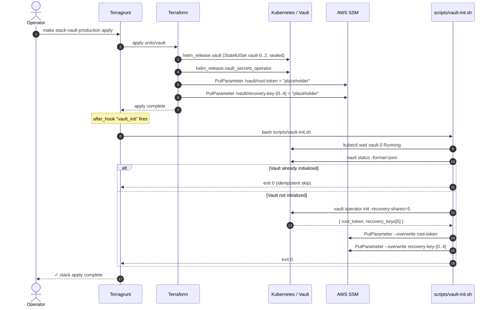
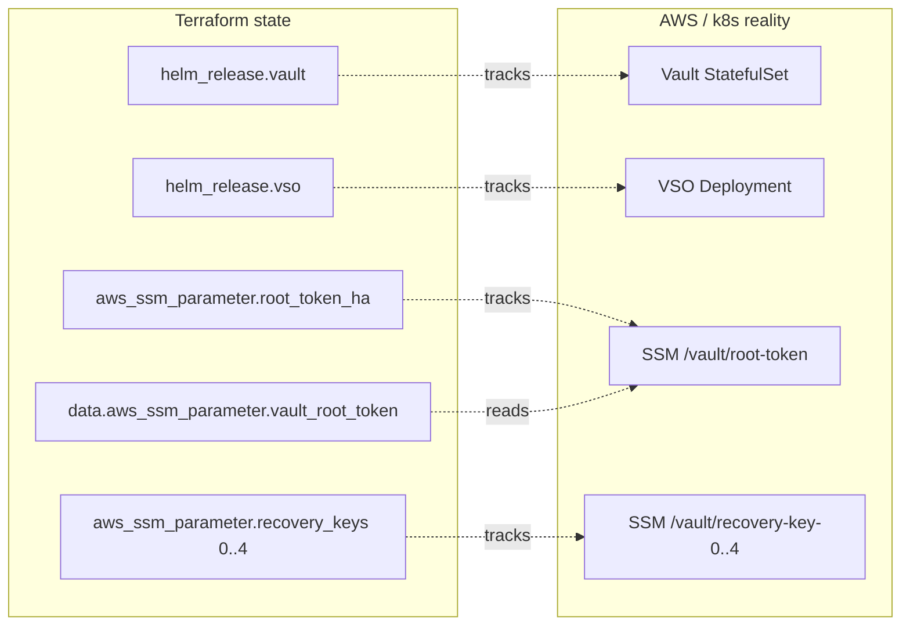
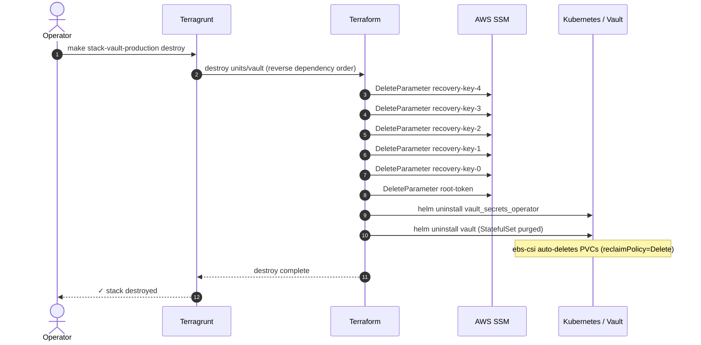
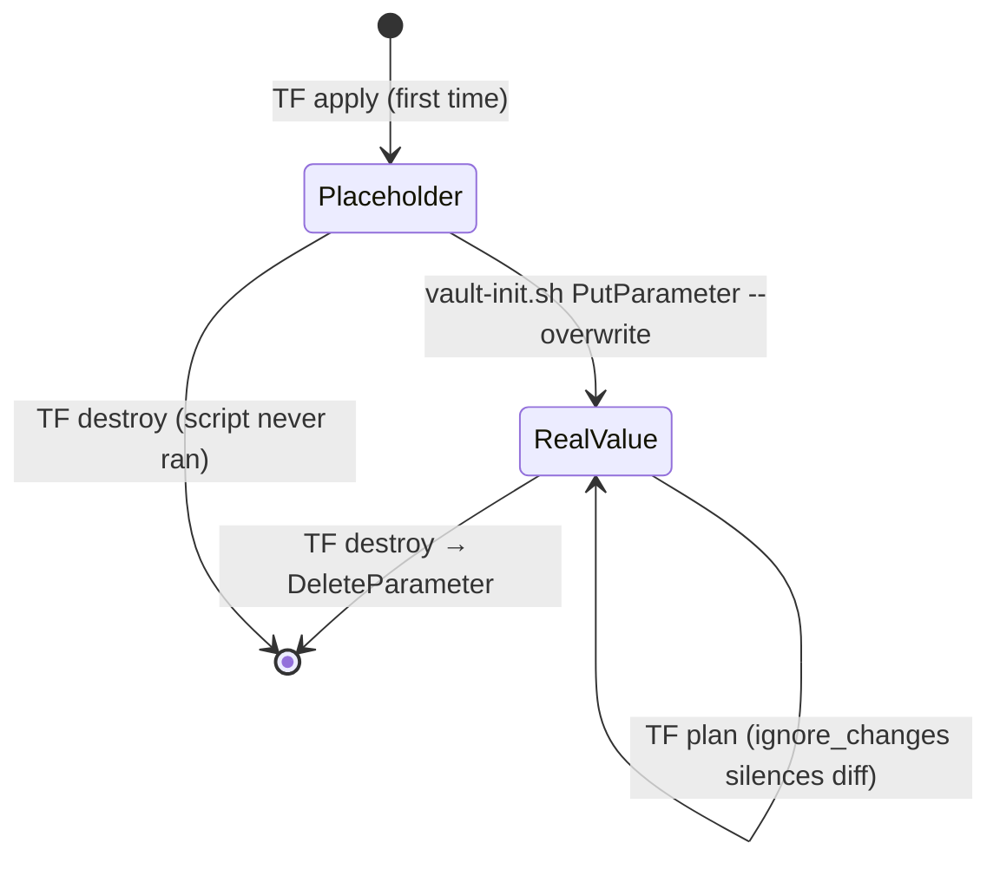

# ADR 0004: Vault init via external script (Tier 1)

Date: 2026-05-06
Status: Accepted

## Context

Vault HA on Kubernetes requires a one-time `vault operator init` ceremony after the StatefulSet starts. The init returns a root token and 5 recovery keys that must be persisted (SSM SecureString) so downstream units (`vault-config`, `certs`) can authenticate to Vault.

The previous implementation embedded the init logic inline in Terraform via `terraform_data` + `local-exec` provisioners:

- `aws ssm put-parameter` calls happened inside a heredoc `bash` block
- SSM parameters were created **outside Terraform state** (out-of-band side effects)
- A second `terraform_data` with `provisioner "local-exec" { when = destroy }` mirrored the writes with `aws ssm delete-parameters`

This pattern caused:

1. **Destroy leaks.** The `when = destroy` hook used `|| true` and ran in a shell environment that could lose AWS credentials, time out, or be skipped on `Ctrl-C`. Six SSM parameters were found orphaned in production (root token + 5 recovery keys) after a partial destroy.
2. **Drift invisible to plan.** `terraform plan` could not show SSM parameters that existed in AWS, because they were not tracked.
3. **Init logic untestable.** The shell heredoc inside `terraform_data` could only be exercised via a full `terraform apply`. No way to dry-run, lint, or unit-test the bash.
4. **Anti-pattern.** HashiCorp's own style guide flags `local-exec` provisioners as last-resort, and the `when = destroy` form is documented as fragile.

## Decision

Adopt the **Tier 1** pattern: separate declarative resource lifecycle (Terraform) from imperative one-time bootstrap (external script).

### Components

| Component | Responsibility |
|---|---|
| `aws_ssm_parameter` resources in `units/vault/init_*.tf` | Declare SSM parameters in TF state. `value = "placeholder-…"`, `lifecycle { ignore_changes = [value] }` |
| `helm_release.vault` | Install Vault Helm chart (sealed, uninitialized) |
| `scripts/vault-init.sh` | Idempotent bootstrap: wait Vault ready → `vault operator init` → `aws ssm put-parameter --overwrite` |
| `terragrunt after_hook "vault_init"` | Invoke `scripts/vault-init.sh` after `terragrunt apply` succeeds |
| `data "aws_ssm_parameter" "vault_root_token"` | Downstream units read SSM via data source (unchanged) |

### Apply flow



### State vs reality



Every AWS object has a TF state counterpart. No orphans possible.

### Destroy flow



No shell hooks. No `|| true`. Failures fail loud — TF errors halt destroy, operator must address before retry.

### Drift handling



`lifecycle { ignore_changes = [value] }` keeps state clean across plan/apply cycles after the script overwrites the placeholder.

### Why `ignore_changes = [value]`

The script overwrites the placeholder with the runtime token/keys. On the next `terraform plan`, the in-state value (`"placeholder-…"`) differs from AWS reality (real token). Without `ignore_changes`, Terraform would propose a diff every plan and reset the SSM value on the next apply.

`ignore_changes = [value]` tells Terraform: "I own the resource lifecycle, but the value is mutated externally — don't reconcile it."

### Idempotency

`scripts/vault-init.sh` checks Vault status before running init:

```bash
INITIALIZED=$(... | jq .initialized)
[ "$INITIALIZED" = "True" ] && exit 0
```

Safe to re-run on every apply.

`aws ssm put-parameter --overwrite` is idempotent regardless of placeholder vs real value.

## Consequences

### Gains

- **Zero leak risk on destroy.** SSM parameters are TF resources; their delete is a Terraform AWS-API call, not a shell hook.
- **Plan reflects reality.** `terraform plan` shows SSM parameters as managed resources; orphans become visible.
- **Init logic testable in isolation.** `VAULT_MODE=ha bash -x scripts/vault-init.sh` runs the bootstrap outside Terraform.
- **Smaller TF surface.** Init `.tf` files dropped from ~80 lines of heredoc bash to ~25 lines of resource declarations.
- **Single command apply preserved.** `terragrunt after_hook` runs the script automatically; users still type `make stack-vault-production apply`.

### Costs

- New file `scripts/vault-init.sh` to maintain.
- `lifecycle.ignore_changes = [value]` requires future readers to understand: drift is intentional.
- After-hook coupling: if `terragrunt apply` succeeds at the TF phase but the after-hook fails, SSM has placeholder values until the next apply. The script is idempotent, so re-running fixes it.

### Migration impact

Existing production state has `terraform_data.vault_init_*` and the cleanup blocks. On the next `terraform apply`:

1. Terraform will plan to destroy `terraform_data.vault_init_ha` (no replacement)
2. Terraform will plan to destroy `terraform_data.vault_ssm_cleanup_ha` — runs the `when = destroy` provisioner once → calls `aws ssm delete-parameters`
3. Terraform will plan to create `aws_ssm_parameter.vault_root_token_ha` and `aws_ssm_parameter.vault_recovery_keys[0..4]` with placeholder values
4. The `after_hook` runs `scripts/vault-init.sh`, which sees Vault already initialized → exits 0 without writing SSM

**Result:** the migration apply leaves SSM parameters in placeholder state, because step 2 runs before steps 3-4 and step 4 short-circuits on idempotency check.

**Workaround for migration:** before the first apply on the new code, manually run `bash scripts/vault-init.sh` once to bootstrap the SSM placeholders to real values. Or: remove the idempotency `exit 0` for the migration apply only, then restore.

For greenfield deploys (state empty, infra fresh) no migration concern.

## Alternatives rejected

- **Tier 2** (`aws_ssm_parameter` placeholder + `terraform_data` for init): cleaner SSM lifecycle, but keeps `terraform_data + local-exec` anti-pattern. Half-measure.
- **Vault operator (bank-vaults, vault-secrets-operator init mode)**: defers init to a Kubernetes operator. More moving parts; operator itself becomes a dependency to manage. Considered for future; not adopted now.
- **Pure Tier 1 without after-hook**: requires explicit `make vault-init` step after `make stack-…-apply`. Breaks one-command apply UX. Rejected.

## References

- HashiCorp Provisioner docs: https://developer.hashicorp.com/terraform/language/resources/provisioners/syntax
- Terragrunt hooks: https://terragrunt.gruntwork.io/docs/features/before-and-after-hooks/
- Linked code:
  - `units/vault/init_dev.tf`
  - `units/vault/init_ha.tf`
  - `units/vault/main.tf` (data source)
  - `units/vault/terragrunt.hcl` (after_hook)
  - `scripts/vault-init.sh`
