# Cluster Lifecycle — Step by Step

Audience: anyone (no prior infra/k8s knowledge required).

This explains exactly what happens when you run `make stack-vault-production apply` or `destroy` — what each piece is, why it exists, and what depends on what.

---

## Glossary (read first)

| Term | Plain meaning |
|---|---|
| **AWS** | Cloud provider where everything runs |
| **VPC** | A private network inside AWS — isolates this project from others |
| **Subnet** | A slice of the VPC. Pods live in private subnets; load balancers in public subnets |
| **EKS** | Managed Kubernetes from AWS. The "computer cluster" that runs containers |
| **Pod** | One running container (or small group) inside Kubernetes |
| **Helm** | Package manager for Kubernetes. Like `apt-get install` but for k8s apps |
| **IAM role** | An AWS identity that grants permissions to do things in AWS |
| **IRSA** | "IAM Roles for Service Accounts" — lets a pod assume an AWS IAM role without API keys |
| **KMS** | AWS Key Management Service — provides encryption keys |
| **RDS** | Managed PostgreSQL database from AWS |
| **Vault** | Secret manager. Stores DB passwords, API keys, TLS certs. Apps fetch secrets at runtime instead of hard-coding them |
| **Vault unseal** | Vault encrypts itself at rest. To start, it needs a key to "unseal." We use AWS KMS to provide that key automatically |
| **Linkerd** | A "service mesh." It transparently adds mTLS encryption + retries + metrics between pods, with no code change in apps |
| **ArgoCD** | GitOps controller. Watches a Git repo and keeps Kubernetes synced with what's in Git |
| **ALB** | Application Load Balancer (AWS) — the public HTTPS endpoint that routes traffic to pods |
| **Target Group** | List of pod IPs the ALB sends traffic to |
| **TargetGroupBinding** | A Kubernetes resource that tells the ALB controller "register pods of service X to target group Y" |
| **SSM Parameter Store** | AWS's encrypted key/value store. We use it to remember the Vault root token between machines |
| **Terraform / Terragrunt** | The tools that build all this infrastructure declaratively from the `units/` and `stacks/` folders |

---

## Apply (create cluster) — full flow

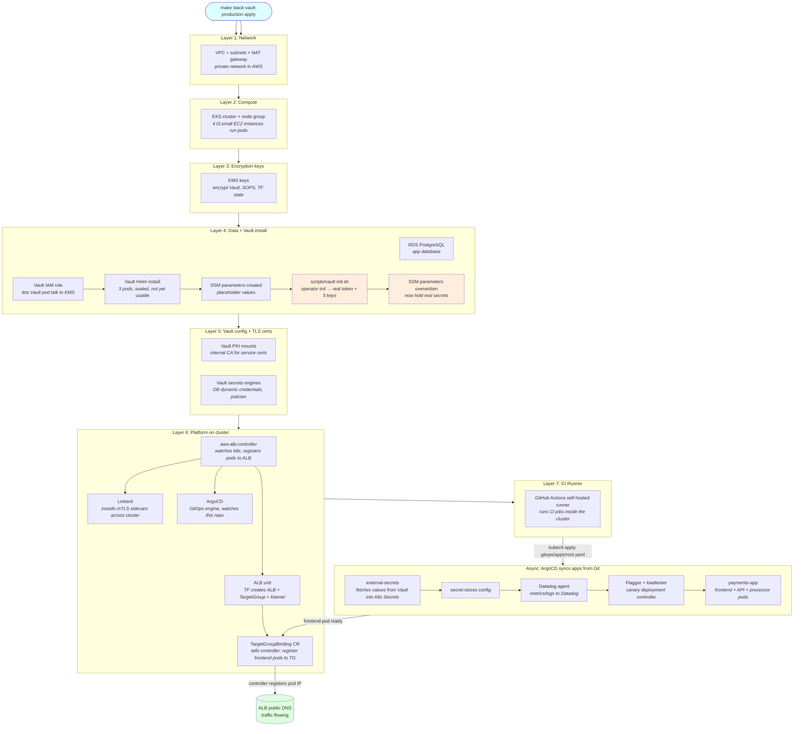

### Step-by-step narration

#### Step 1 — VPC (private network)

**What:** Carves out an isolated network in AWS (`10.0.0.0/16`).
- Public subnets: where the load balancer lives (reachable from internet)
- Private subnets: where pods + database live (NOT reachable from internet)
- NAT gateway: lets private pods reach the internet for image pulls etc., but not vice-versa

**Why first:** everything else needs a network to live in.

#### Step 2 — EKS (Kubernetes cluster)

**What:** AWS-managed Kubernetes control plane + 4 worker EC2 nodes (`t3.small`).
- Control plane = the "brain" — schedules pods, tracks state
- Nodes = the actual servers running container workloads
- Add-ons installed: VPC-CNI, kube-proxy, CoreDNS, EBS-CSI driver

**Why second:** all later layers run as pods inside this cluster.

#### Step 3 — KMS (encryption keys)

**What:** Three customer-managed encryption keys:
- Vault auto-unseal key (used in step 4 to unlock Vault)
- SOPS key (encrypt secrets in Git)
- Terraform state encryption key

**Why before Vault:** Vault references the unseal key.

#### Step 4 — Data + Vault install

This layer has 5 sub-steps that run in dependency order:

##### 4a. RDS PostgreSQL
A managed Postgres database (`db.t3.micro`). Multi-AZ disabled. Used by the payments app.

##### 4b. Vault IAM role (vault-irsa)
Creates an IAM role + IRSA mapping so the Vault pod can call `kms:Decrypt` on the unseal key from step 3.

##### 4c. Helm install Vault (HA mode)
Helm chart deploys 3 Vault pods (`vault-0`, `vault-1`, `vault-2`) configured with raft storage and AWS KMS auto-unseal. Pods start **sealed** — they can't yet store/serve secrets.

##### 4d. SSM parameter placeholders
Six AWS SSM parameters created (`/terragrunt-infra/vault/root-token` + 5 recovery keys), all containing `"placeholder"`. These are tracked in Terraform state — important for clean destroy later.

##### 4e. `scripts/vault-init.sh` runs (terragrunt after-hook)
- Waits until `vault-0` pod is `Running`
- Calls `vault operator init -recovery-shares=5 -recovery-threshold=3`
- Vault returns: `{ root_token, recovery_keys[5] }` (one-time event!)
- Writes those values to the SSM parameters from step 4d (`--overwrite`)
- Idempotent: if Vault already initialized, exits 0 without doing anything

After this, Vault is unsealed and operational.

#### Step 5 — Vault config + certs

##### 5a. Certs unit
Creates Vault PKI engine mounts — Vault becomes an internal Certificate Authority. Used for issuing TLS certs to internal services.

##### 5b. Vault config unit
Configures Vault:
- Database secrets engine (Vault generates short-lived DB credentials on demand)
- Auth methods (Kubernetes service account → Vault role)
- Policies (which apps can read which secrets)

#### Step 6 — Platform on cluster

##### 6a. aws-alb-controller
Helm install of the [AWS Load Balancer Controller](https://kubernetes-sigs.github.io/aws-load-balancer-controller/) — a pod that watches Kubernetes for `Ingress` and `TargetGroupBinding` resources and reflects them as AWS ALB / Target Group state.

It needs to install **before** Linkerd and ArgoCD because both deploy Services that may need it. (We don't actually create Ingresses anymore — see step 6d.)

##### 6b. Linkerd
Helm install. Installs:
- `linkerd-crds` — custom resource types
- `linkerd-control-plane` — pods: `linkerd-destination`, `linkerd-identity`, `linkerd-proxy-injector` (in `linkerd` namespace)
- `linkerd-viz` — observability dashboard pods

What Linkerd does at runtime: when a pod is annotated `linkerd.io/inject: enabled`, the proxy injector adds a tiny sidecar container to it. The sidecar transparently encrypts all traffic (mTLS), retries failed requests, and emits golden metrics.

##### 6c. ArgoCD
Helm install. Pods include `argocd-server`, `argocd-application-controller`, `argocd-repo-server`. Once running, ArgoCD watches the `gitops/apps/` folder of this repo and creates Kubernetes resources matching what's in Git.

##### 6d. ALB unit (TF-managed)
- Creates an AWS ALB + Target Group + Listener via Terraform
- Creates a `TargetGroupBinding` Kubernetes resource (CRD from aws-alb-controller)
- The TGB tells the controller: "register pods of service `frontend` in namespace `payments-app` to this Target Group"
- Because the ALB lives in TF state, `terraform destroy` deletes it cleanly. No leak.

#### Step 7 — GitHub runner

Helm install of `actions-runner-controller` + a runner scale set. Lets GitHub Actions jobs run inside the cluster (private VPC access) instead of GitHub-hosted runners.

#### Async — ArgoCD syncs apps from Git

Once the cluster is up, you (or CI) run:
```bash
make gitops-bootstrap   # kubectl apply -f gitops/apps/root.yaml
```

This creates one ArgoCD Application named `root`, which watches `gitops/apps/` recursively. Children apps deploy in **sync wave** order:

| Wave | App | What |
|---|---|---|
| 0 | external-secrets | Helm operator that fetches secrets from Vault → creates k8s Secret objects |
| 1 | secret-stores | Configures `SecretStore` CRs that point external-secrets at Vault |
| 2 | datadog | Installs the Datadog agent (logs/metrics) |
| 3 | flagger / loadtester | Canary deployment controller + traffic generator |
| 4 | payments-app | The actual app: frontend, API, processor, product DB |

When the `payments-app` `frontend` pod becomes Ready, the aws-alb-controller (running since step 6a) sees it via the TargetGroupBinding from step 6d and registers its IP into the AWS Target Group. Now the ALB's public DNS serves real traffic.

---

## Destroy — short flow

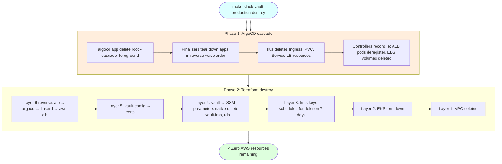

### Why this destroy is leak-free

| Concern | How handled |
|---|---|
| **k8s LoadBalancer / Ingress orphans ALB** | ArgoCD cascade deletes apps → Ingress → ALB controller cleans LB |
| **PVC orphans EBS volumes** | `kubectl delete pvc` triggers ebs-csi to delete volumes (`reclaimPolicy: Delete`) |
| **SSM parameters orphan** | Tracked as `aws_ssm_parameter` resources → TF destroy calls AWS DeleteParameter |
| **ALB itself** | TF-managed in `units/alb` → TF destroy calls AWS DeleteLoadBalancer |
| **KMS keys pile up** | `deletion_window_in_days = 7` (was 10 / 30) — minimal lingering |

If any phase fails, the workflow halts loud. No silent `|| true` paths.

---

## Mental model summary

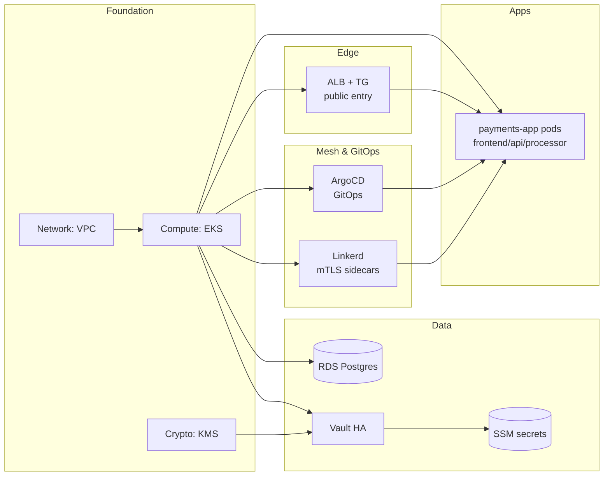

- **Foundation** is built once by Terraform, slow-changing
- **Data** holds state (DB rows, secrets)
- **Mesh & GitOps** are infrastructure for safer/easier app delivery
- **Edge** is how the world reaches your app
- **Apps** are what users actually use

Everything below `Apps` exists to make `Apps` reliable, secure, and observable.

---

## Runtime — what happens when a user makes a request

Cluster is up. User opens browser, hits the ALB DNS. This section traces a single HTTP request through every component.

### Request lifecycle

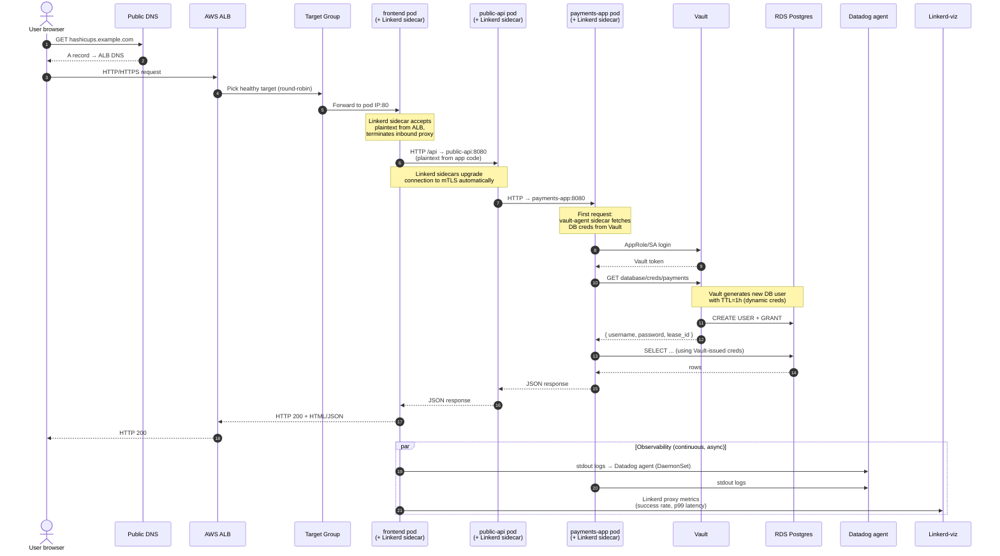

### Step-by-step narration

#### 1-3. DNS and ALB

User's browser does a DNS lookup for the app's hostname (in a real setup you'd put a CNAME pointing to the ALB DNS — for demo, you can hit the ALB DNS directly).

The ALB lives in public subnets and has a security group allowing port 80 from `0.0.0.0/0`.

#### 4. Target Group selects pod

The ALB's HTTP listener forwards to a Target Group. The Target Group has a list of pod IPs (registered by `aws-alb-controller` because of the `TargetGroupBinding` we declared in the `alb` Terraform unit).

Health checks on the TG (`GET /` expects 200-399) ensure only Ready pods get traffic.

#### 5-6. Pod receives, Linkerd handles

Each pod has 2 containers running:
- The actual app container (`frontend`)
- A Linkerd `proxy` sidecar (auto-injected because the namespace has `linkerd.io/inject=enabled`)

The sidecar transparently:
- Terminates incoming connections
- Upgrades pod-to-pod traffic to mTLS (without app code knowing)
- Records latency, success rate, traffic volume

#### 7-8. Internal mTLS hops

`frontend` → `public-api` → `payments-app`. Each hop:
- App code makes a plain HTTP call to `<service>:<port>`
- Local Linkerd sidecar intercepts, encrypts, sends to remote sidecar
- Remote sidecar decrypts, hands plaintext to remote app

App developer sees plaintext. Network sees mTLS only.

#### 9-13. Vault dynamic database credentials

When `payments-app` needs to query the database:

1. The pod has a **vault-agent sidecar** (separate from Linkerd's sidecar — it's a Helm-chart-injected init/sidecar that handles secret retrieval).
2. Vault-agent authenticates to Vault using the pod's Kubernetes ServiceAccount token (Kubernetes auth method).
3. Vault-agent calls `database/creds/payments`. Vault, using its DB secrets engine, runs `CREATE USER + GRANT` on RDS, returns a fresh username/password with a 1-hour lease.
4. Vault-agent writes the creds to a file inside the pod (`/vault/secrets/database.properties`).
5. App reads the file and connects to RDS.

When the lease expires, Vault revokes the user automatically. **No long-lived password ever exists in the app's memory or environment.**

#### 14-16. Database and response

The app queries RDS using the short-lived creds, gets results, returns up the chain.

#### 17-18. Response back to user

`payments-app` → `public-api` → `frontend` → ALB → user. All inter-pod hops are mTLS via Linkerd.

#### Async — Observability

While the request flows, two things happen continuously:

- **Datadog agent (DaemonSet on every node)** scrapes pod stdout/stderr, OS metrics, k8s events. Sends to Datadog SaaS.
- **Linkerd proxies** emit golden metrics (success rate, requests/sec, p50/p95/p99 latency) which `linkerd-viz` aggregates. View them with `linkerd viz dashboard`.

### What each component contributes

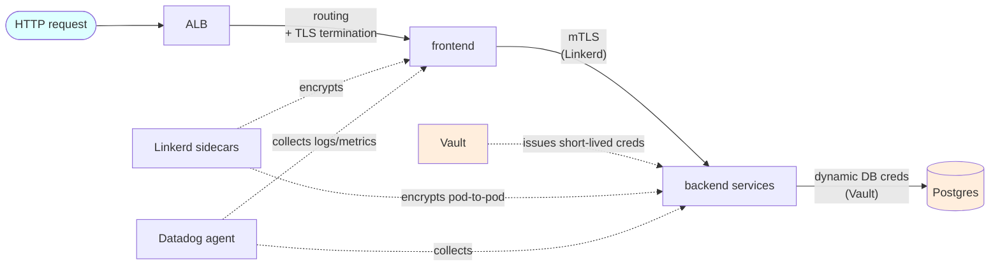

| Component | Job at request time |
|---|---|
| **ALB** | Public entry point. Decides which pod gets the request based on TG health checks. |
| **aws-alb-controller** | Idle at request time. Only acts when pods come and go (registers/deregisters from TG). |
| **Linkerd sidecars** | Encrypt every pod-to-pod hop with mTLS. Auto-retry on transient 5xx. Emit metrics. |
| **Vault** | Issues short-lived DB creds on demand. Apps never store passwords. |
| **vault-agent sidecar** | (Inside each app pod that needs secrets.) Handles Vault login + secret fetch + lease renewal. |
| **Datadog agent** | Collects logs/metrics out-of-band. Doesn't sit in request path. |
| **Linkerd-viz** | Dashboard showing service-graph latency. Out-of-band. |
| **ArgoCD** | Idle at request time. Only acts when Git changes (re-syncs k8s state). |
| **EKS control plane** | Idle. Only acts when pods are created/deleted. |
| **RDS** | Stores actual data. Returns rows. |

### What fails if a component dies

| If this dies | Effect on user requests |
|---|---|
| **ALB** | All traffic stops. Single point of failure (mitigate with multi-AZ — already done) |
| **All frontend pods** | 503 from ALB |
| **Single frontend pod** | TG marks unhealthy, ALB skips it. No user impact (other replicas handle) |
| **Linkerd control plane** | Existing connections keep working (sidecars cache config). New pods can't get certs → eventually fail to start |
| **Vault** | Apps can't fetch new DB creds. Existing leases keep working until expiry (~1h). After that, DB calls fail |
| **RDS** | DB queries fail → 500s for any endpoint that hits Postgres |
| **Datadog** | No observability, but request flow unaffected |
| **ArgoCD** | No deployments possible. Running apps unaffected |
| **Linkerd-viz** | Dashboard unavailable. mTLS still works (control plane runs Linkerd-viz separately) |

This blast-radius table is the value of the architecture: each component fails independently. None take down the whole system.

---

## Vault deep dive — full secret lifecycle

Vault is the most-asked-about piece. This section covers every Vault flow end-to-end:

1. First-time init (one-time)
2. Auto-unseal on every pod restart
3. How operators read the root token
4. How `vault-config` unit configures Vault during apply
5. How apps fetch dynamic DB creds at runtime
6. Day-2 ops: rotation, lease cleanup, recovery
7. Disaster recovery (KMS unseal fails)

### 1. First-time init (apply phase, runs once ever)

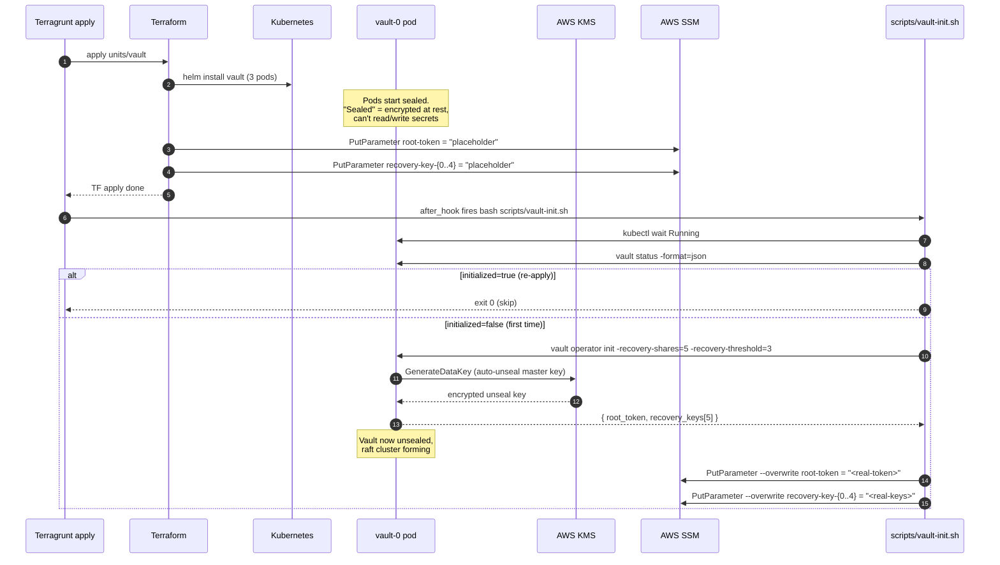

**Key facts:**

- `vault operator init` runs **once for the lifetime of the Vault cluster**. Re-running on initialized Vault is a no-op (script's `initialized=true` check).
- The 5 recovery keys are a Shamir secret-shared backup. To unseal Vault manually (if KMS dies), an operator needs at least **3 of 5** keys.
- Auto-unseal means: every time a Vault pod restarts, it asks AWS KMS to decrypt its on-disk seal key. No manual unseal needed in normal ops.

### 2. Auto-unseal on every pod restart (runs on every pod boot)

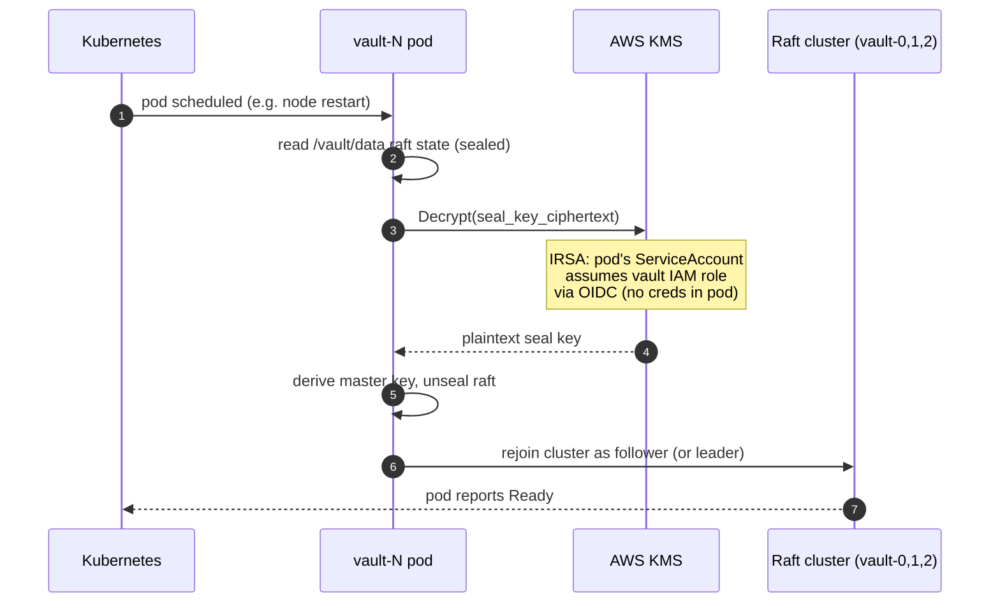

**Why IRSA matters:** the Vault pod has no AWS access keys in env or volumes. The IAM role is mapped to the `vault` ServiceAccount (set up by `units/vault-irsa`). When the pod calls KMS, AWS validates the OIDC token from the pod's ServiceAccount and grants temporary credentials. Zero secrets in the pod itself.

### 3. How operators read the root token (manual)

After init, the root token lives in SSM. Operators retrieve it via:

```bash
# One-shot read (from any machine with AWS creds)
aws ssm get-parameter \
  --name /terragrunt-infra/vault/root-token \
  --with-decryption \
  --query Parameter.Value \
  --output text
```

Or set up a Vault session for `make` targets:

```bash
source scripts/load_env.sh production   # exports VAULT_TOKEN + VAULT_ADDR

make vault-status      # health check
make vault-db-creds    # generate dynamic DB cred (test)
make vault-rotate-db   # rotate the DB root password Vault uses
```

The Makefile (`makefiles/vault.mk`) port-forwards `vault` service to `localhost:18200` and uses the token to call Vault's HTTP API.

### 4. `vault-config` unit configures Vault (apply phase)

Right after init succeeds, the `vault-config` unit runs (Layer 5). It reads the root token from SSM and configures Vault:

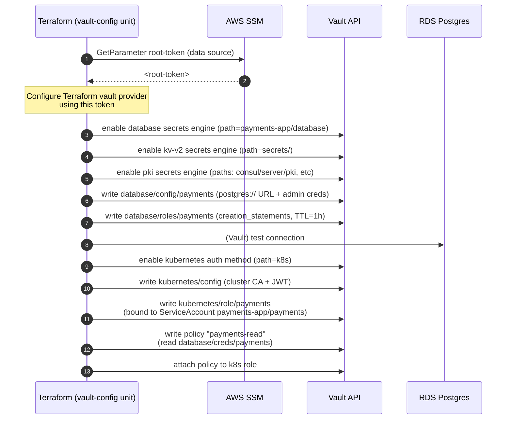

Once this runs, Vault knows:
- How to talk to RDS (admin creds, role templates)
- Which Kubernetes ServiceAccounts can authenticate
- Which secrets each authenticated identity can read

### 5. App fetches dynamic creds at runtime (request flow recap)

Already covered in the request lifecycle above. Quick recap:

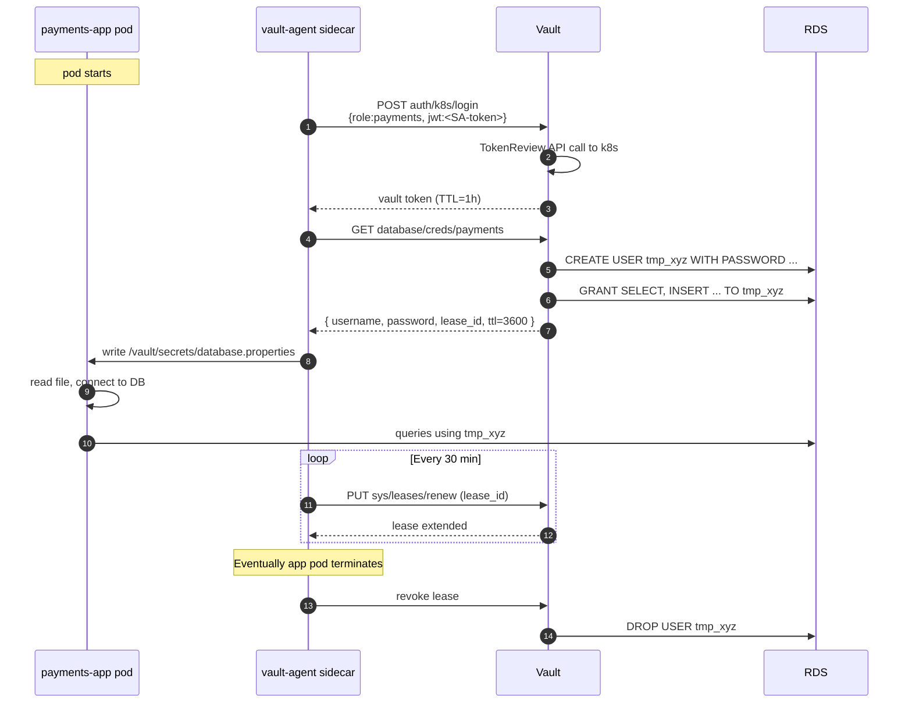

Static passwords never exist. If a pod is compromised, the worst case is a 1-hour-valid DB user, automatically revoked when the lease expires.

### 6. Day-2 operations

| Task | Command | Effect |
|---|---|---|
| View Vault health | `make vault-status` | Returns sealed/unsealed, leader, version |
| Generate test DB creds | `make vault-db-creds APP=payments-app` | Vault issues a fresh ephemeral user |
| Rotate DB root password | `make vault-rotate-db APP=payments-app` | Vault generates new admin password, updates RDS, updates own config. Apps unaffected |
| Force-revoke all DB leases | `make vault-lease-clean APP=payments-app` | Drops all dynamic users immediately. Use during incident |
| Manually unseal | `kubectl exec vault-0 -- vault operator unseal <key>` × 3 | Only needed if KMS auto-unseal fails (see DR section) |
| View PKI cert chain | `make vault-pki-roots` | Shows internal CA chain |

### 7. Disaster recovery — KMS auto-unseal fails

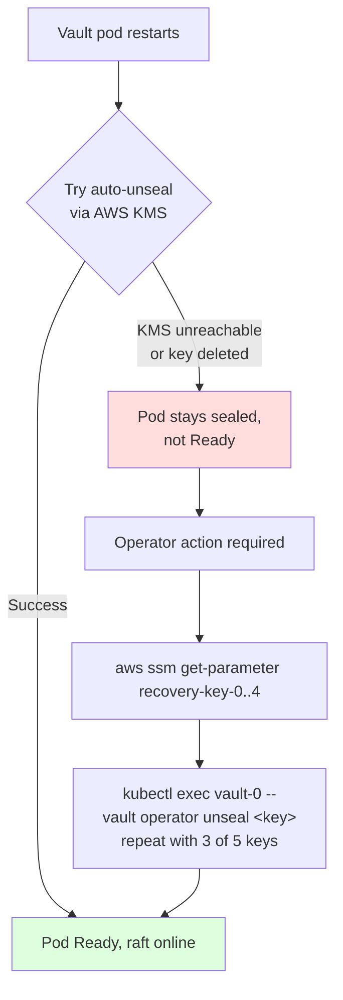

Recovery keys (the 5 stored in SSM) are the manual fallback. Why we keep them:

- AWS KMS could theoretically be unavailable (rare)
- Someone could accidentally delete the unseal KMS key
- Account-level access loss → last-resort recovery

**To unseal manually:**

```bash
# 1. Fetch 3 recovery keys
for i in 0 1 2; do
  aws ssm get-parameter \
    --name /terragrunt-infra/vault/recovery-key-$i \
    --with-decryption --query Parameter.Value --output text
done

# 2. Run unseal 3 times (one per key)
kubectl exec vault-0 -n vault -- vault operator unseal <key-0>
kubectl exec vault-0 -n vault -- vault operator unseal <key-1>
kubectl exec vault-0 -n vault -- vault operator unseal <key-2>

# 3. Repeat for vault-1, vault-2 if needed
```

### Vault component map

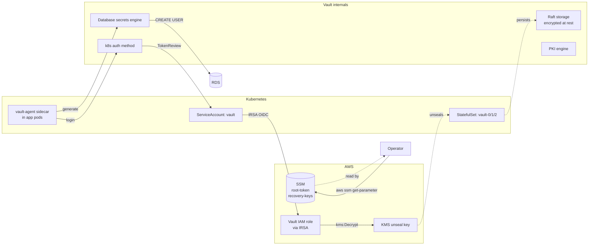

### TL;DR for non-experts

- **Vault** = secret vault. Apps don't store passwords; they ask Vault for fresh ones.
- **Sealed/unsealed** = locked/unlocked. We use AWS KMS to unlock automatically.
- **Root token** = master admin key. Stored in AWS SSM (encrypted). Operators fetch it on demand.
- **Recovery keys** = 5 backup keys. Need 3 to manually unlock if AWS KMS dies. Stored in SSM.
- **Dynamic DB creds** = Vault creates a new DB user for each app session, deletes it after 1 hour. No password ever stored in app.
- **vault-agent** = sidecar in app pods. Logs into Vault using k8s identity, fetches secrets, writes them to a file the app reads.
